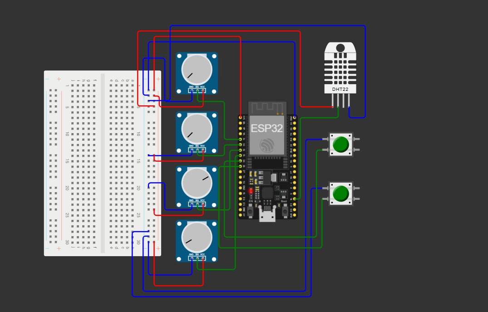
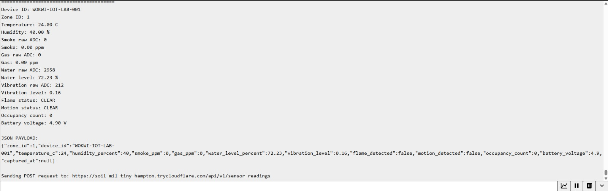
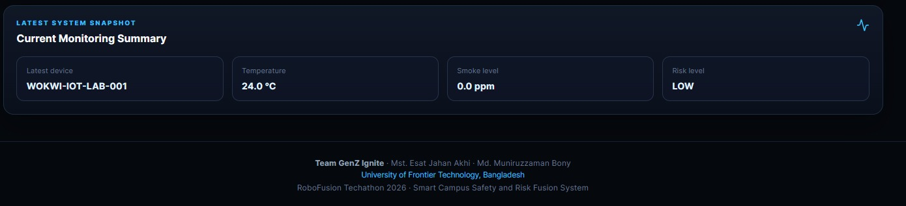
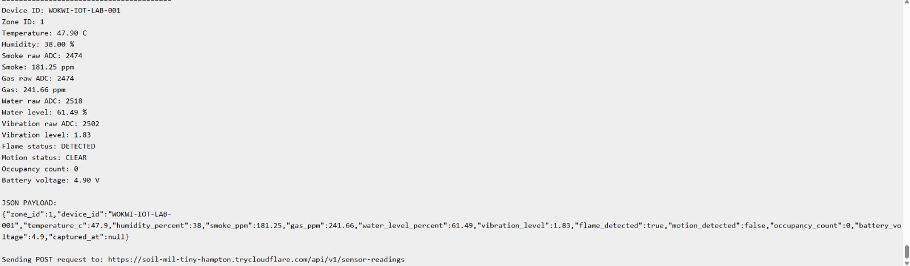
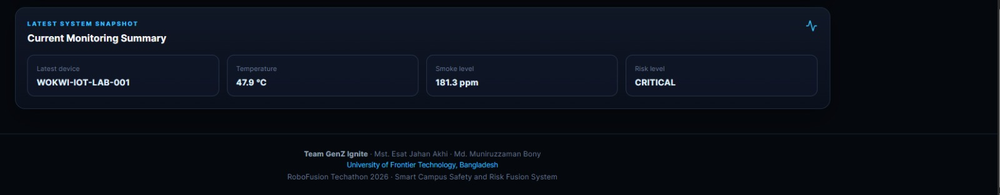
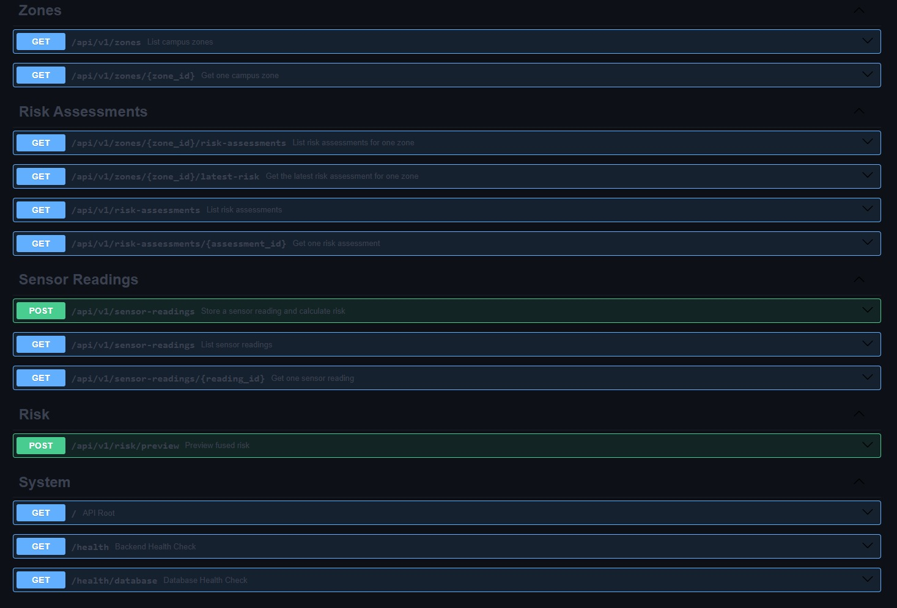
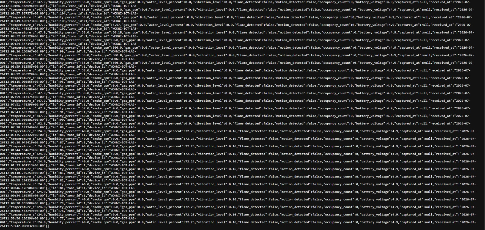

# 🚀 RoboFusion Techathon 2026

# Smart Campus Safety & Response Grid (SCS-RG)

An end-to-end IoT-enabled Smart Campus Safety platform that continuously monitors environmental conditions, performs intelligent risk fusion, stores historical safety data, and visualizes real-time campus safety information through an interactive web dashboard.

---

## 👥 Team

### GenZ Ignite

- **Mst. Esat Jahan Akhi**
- **Md. Muniruzzaman Bony**

**University of Frontier Technology, Bangladesh**

---

# 📖 Project Overview

Traditional campus monitoring systems usually monitor individual sensors separately. This often delays emergency response because decision makers must manually interpret multiple sensor readings.

Our solution combines multiple environmental parameters into a unified **Risk Fusion Engine**, allowing campus administrators to identify dangerous situations instantly through a single intelligent risk score.

Instead of showing isolated sensor values, the system provides:

- Real-time environmental monitoring
- Intelligent multi-sensor risk analysis
- Historical risk analytics
- Zone-based monitoring
- Interactive safety dashboard
- Centralized database storage

The complete system was developed for **RoboFusion Techathon 2026**.

---

# 🎯 Problem Statement

Educational institutions contain multiple laboratories, server rooms and research facilities where environmental hazards may occur.

Examples include:

- Fire
- Smoke leakage
- Gas leakage
- Excessive temperature
- Water leakage
- Equipment vibration
- Unauthorized movement

Most traditional monitoring systems only generate independent sensor alerts.

Problems include:

- No overall risk score
- Difficult decision making
- No centralized visualization
- Poor historical analysis
- Slow emergency response

---

# 💡 Proposed Solution

Our Smart Campus Safety & Response Grid continuously collects sensor information from every campus zone.

The collected sensor data is securely transmitted to a centralized backend where an intelligent Risk Fusion Engine evaluates the combined environmental condition.

The generated risk score is stored inside PostgreSQL and visualized through an interactive React dashboard.

This architecture enables administrators to monitor every campus zone from a single interface while receiving real-time risk intelligence.

---

# 🎯 Project Objectives

- Monitor multiple environmental sensors simultaneously.
- Collect sensor readings from distributed ESP32 zone nodes.
- Calculate an intelligent fused risk score.
- Store all readings for historical analysis.
- Provide a modern web dashboard.
- Support future deployment using real ESP32 hardware.
- Demonstrate a complete IoT architecture from sensing to visualization.

---

# ⭐ Key Features

## IoT Layer

- ESP32 Zone Node
- DHT22 Temperature & Humidity
- Smoke Sensor
- Gas Sensor
- Water Level Sensor
- Vibration Sensor
- Flame Detection
- Motion Detection

---

## Backend

- FastAPI
- SQLAlchemy ORM
- PostgreSQL
- REST API
- Risk Fusion Engine
- Automatic Risk Assessment
- Health Monitoring API

---

## Frontend

- React
- TypeScript
- Vite
- Responsive Dashboard
- Live KPI Cards
- Charts
- Risk Tables
- Zone Monitoring

---

## Simulation

- Wokwi ESP32 Simulation
- Cloudflare Tunnel
- HTTPS Communication
- Live Sensor Streaming

---

# 🏗️ System Architecture

```

             +-----------------------------+
             |      Wokwi ESP32 Node       |
             |                             |
             | Temperature                 |
             | Humidity                    |
             | Smoke                       |
             | Gas                         |
             | Water                       |
             | Vibration                   |
             | Flame                       |
             | Motion                      |
             +-------------+---------------+
                           |
                           |
                     HTTPS JSON
                           |
                           |
            Cloudflare Secure Tunnel
                           |
                           |
                    FastAPI Backend
                           |
                           |
                 Risk Fusion Engine
                           |
                           |
                     PostgreSQL DB
                           |
                           |
               React Monitoring Dashboard

```

---

# 🔄 Complete Data Flow

ESP32 Sensor Node

↓

Sensor Data Collection

↓

JSON Serialization

↓

HTTPS POST Request

↓

FastAPI REST API

↓

Data Validation

↓

Database Storage

↓

Risk Fusion Engine

↓

Risk Assessment Storage

↓

Dashboard Visualization

---

# 🛠 Technology Stack

| Layer                | Technology        |
| -------------------- | ----------------- |
| Programming Language | Python            |
| Backend Framework    | FastAPI           |
| ORM                  | SQLAlchemy        |
| Database             | PostgreSQL        |
| API Validation       | Pydantic v2       |
| Frontend             | React             |
| Build Tool           | Vite              |
| Language             | TypeScript        |
| Charts               | Recharts          |
| Simulation           | Wokwi             |
| IoT Hardware         | ESP32             |
| Tunnel               | Cloudflare Tunnel |
| Version Control      | Git               |
| Repository           | GitHub            |

---

# 📁 Repository Structure

```text
RoboFusion_SCS_RG
│
├── backend
│   ├── app
│   │   ├── api
│   │   ├── core
│   │   ├── db
│   │   ├── models
│   │   ├── schemas
│   │   ├── services
│   │   └── main.py
│   │
│   ├── alembic
│   ├── tests
│   ├── requirements.txt
│   └── .env.example
│
├── frontend
│   ├── src
│   ├── public
│   ├── package.json
│   └── vite.config.ts
│
├── simulation
│   └── wokwi-zone-node
│       ├── sketch.ino
│       ├── diagram.json
│       ├── libraries.txt
│       └── README.md
│
├── evidence
│
├── docs
│
├── README.md
│
└── LICENSE
```

---

# Backend Architecture

The backend is developed using **FastAPI**.

Main responsibilities:

- Receive sensor readings
- Validate JSON payload
- Store readings into PostgreSQL
- Execute Risk Fusion algorithm
- Generate Risk Assessment
- Serve REST APIs
- Provide health monitoring endpoints

Backend components include:

- FastAPI
- SQLAlchemy ORM
- PostgreSQL
- Alembic
- Pydantic v2

---

# Frontend Architecture

The frontend is developed using:

- React
- TypeScript
- Vite

Dashboard features include:

- KPI Cards
- Zone Monitoring
- Sensor Readings Table
- Risk Assessment Table
- Risk Trend Chart
- Sensor Analytics Chart
- Auto Refresh
- Responsive Design

---

# ESP32 Zone Node

Each zone uses one ESP32 device.

Current implementation uses Wokwi simulation.

Future deployment supports physical ESP32 hardware without changing the backend.

---

# Wokwi Simulation

Simulation Components

| Component               | Quantity |
| ----------------------- | -------- |
| ESP32 DevKit V1         | 1        |
| DHT22                   | 1        |
| Smoke Potentiometer     | 1        |
| Gas Potentiometer       | 1        |
| Water Potentiometer     | 1        |
| Vibration Potentiometer | 1        |
| Flame Button            | 1        |
| Motion Button           | 1        |

---

# Pin Mapping

| Component | ESP32 Pin |
| --------- | --------- |
| DHT22     | GPIO15    |
| Smoke     | GPIO34    |
| Gas       | GPIO35    |
| Water     | GPIO32    |
| Vibration | GPIO33    |
| Flame     | GPIO25    |
| Motion    | GPIO26    |

---

# Sensor Parameters

The system continuously monitors:

- Temperature
- Humidity
- Smoke
- Gas
- Water Level
- Vibration
- Flame
- Motion
- Battery Voltage
- Occupancy Count

---

# Communication Protocol

The ESP32 sends sensor data using HTTPS POST requests.

Communication Flow

ESP32

↓

HTTPS

↓

Cloudflare Tunnel

↓

FastAPI

↓

PostgreSQL

↓

Dashboard

---

# JSON Payload Example

```json
{
  "zone_id": 1,
  "device_id": "WOKWI-IOT-LAB-001",
  "temperature_c": 24,
  "humidity_percent": 40,
  "smoke_ppm": 0,
  "gas_ppm": 0,
  "water_level_percent": 0,
  "vibration_level": 0,
  "flame_detected": false,
  "motion_detected": false,
  "occupancy_count": 0,
  "battery_voltage": 4.9
}
```

---

# REST API

## Zone APIs

GET

```text
/api/v1/zones
```

---

## Sensor APIs

POST

```text
/api/v1/sensor-readings
```

GET

```text
/api/v1/sensor-readings
```

---

## Risk APIs

POST

```text
/api/v1/risk/preview
```

GET

```text
/api/v1/risk-assessments
```

GET

```text
/api/v1/zones/{zone_id}/latest-risk
```

---

# Database Schema

The system uses PostgreSQL.

Main tables include:

## zones

- id
- code
- name
- location
- description

---

## sensor_readings

- id
- zone_id
- device_id
- temperature
- humidity
- smoke
- gas
- water
- vibration
- flame
- motion
- occupancy
- battery
- received_at

---

## risk_assessments

- id
- sensor_reading_id
- zone_id
- score
- level
- reasons
- created_at

---

# Database Relationship

```text
Zones
   │
   │ 1
   │
   ├───────────────∞
                   │
           Sensor Readings
                   │
                   │ 1
                   │
                   ├──────────────∞
                                  │
                          Risk Assessments
```

---

# Backend Health APIs

Backend Health

```text
/health
```

Database Health

```text
/health/database
```

Both endpoints are used for monitoring backend availability.

---

# 🧠 Risk Fusion Engine

The Risk Fusion Engine is the core decision-making component of the Smart Campus Safety & Response Grid.

Instead of evaluating sensor readings independently, the engine converts every sensor measurement into a normalized risk value between **0 and 100**, applies category-specific weights, and then evaluates emergency override rules.

The engine produces:

- Final numeric risk score
- Risk severity level
- Individual sensor risk breakdown
- Human-readable alert reasons

---

# 📊 Risk Fusion Workflow

```text
Raw Sensor Values
        │
        ▼
Sensor Risk Normalization
        │
        ▼
Individual Risk Scores (0–100)
        │
        ▼
Weighted Risk Fusion
        │
        ▼
Emergency Override Rules
        │
        ▼
Final Score Clamped to 0–100
        │
        ▼
Risk Level Classification
        │
        ▼
Reasons and Risk Breakdown
        │
        ▼
PostgreSQL Storage
        │
        ▼
React Dashboard
```

---

# 🔢 Sensor Risk Normalization

Every sensor is normalized into a risk score between `0` and `100`.

## Increasing-Risk Sensors

For sensors where a higher value indicates greater danger, the following piecewise function is used:

```text
                 0,                               x ≤ S

R(x) =           (x − S)
                 ───────── × 100,                 S < x < C
                  (C − S)

                 100,                             x ≥ C
```

Where:

- `x` = current sensor value
- `S` = safe limit
- `C` = critical limit
- `R(x)` = normalized sensor risk

The resulting value is clamped to the range `0–100`.

---

## Decreasing-Risk Sensors

Battery voltage follows a decreasing-risk formula because lower voltage indicates greater danger.

```text
                 0,                               x ≥ S

R(x) =           (S − x)
                 ───────── × 100,                 C < x < S
                  (S − C)

                 100,                             x ≤ C
```

Where:

- `x` = current battery voltage
- `S` = safe voltage
- `C` = critical voltage

---

# 📐 Sensor Thresholds

The backend uses the following exact safe and critical limits.

| Sensor          |   Safe Limit | Critical Limit | Risk Direction |
| --------------- | -----------: | -------------: | -------------- |
| Temperature     |         30°C |           60°C | Increasing     |
| Humidity        |          70% |           100% | Increasing     |
| Smoke           |       30 ppm |        300 ppm | Increasing     |
| Gas             |       50 ppm |        500 ppm | Increasing     |
| Water Level     |          10% |           100% | Increasing     |
| Vibration       |          0.2 |            3.0 | Increasing     |
| Flame           | Not detected |       Detected | Binary         |
| Occupancy       |   20 persons |    100 persons | Increasing     |
| Battery Voltage |        4.5 V |          3.3 V | Decreasing     |

Flame risk is calculated directly:

```text
Flame detected     → 100 risk
Flame not detected → 0 risk
```

---

# ⚖️ Risk Weights

Each normalized sensor risk contributes to the weighted score according to the following weights.

| Risk Category |   Weight | Percentage Contribution |
| ------------- | -------: | ----------------------: |
| Temperature   |     0.15 |                     15% |
| Humidity      |     0.05 |                      5% |
| Smoke         |     0.18 |                     18% |
| Gas           |     0.17 |                     17% |
| Water         |     0.12 |                     12% |
| Vibration     |     0.10 |                     10% |
| Flame         |     0.13 |                     13% |
| Occupancy     |     0.05 |                      5% |
| Battery       |     0.05 |                      5% |
| **Total**     | **1.00** |                **100%** |

Smoke and gas receive the highest combined contribution because they are major indicators of fire and toxic-air emergencies.

---

# 🧮 Weighted Risk Formula

The weighted base risk score is calculated as:

```text
Rbase =
(0.15 × Rtemperature)
+ (0.05 × Rhumidity)
+ (0.18 × Rsmoke)
+ (0.17 × Rgas)
+ (0.12 × Rwater)
+ (0.10 × Rvibration)
+ (0.13 × Rflame)
+ (0.05 × Roccupancy)
+ (0.05 × Rbattery)
```

Where every individual risk value is between `0` and `100`.

Since the weights sum to `1.00`, the weighted base score also remains within the `0–100` range before emergency overrides are applied.

---

# 🚨 Emergency Override Rules

The system includes three emergency override rules so that severe hazards cannot be hidden by averaging.

## Override 1 — Flame Emergency

When the flame sensor is triggered:

```text
Final candidate score = max(weighted base score, 90)
```

Therefore, every detected flame produces at least:

```text
Risk Score: 90
Risk Level: CRITICAL
```

Reason added:

```text
Flame sensor triggered.
```

---

## Override 2 — Combined Smoke and Gas Emergency

When both conditions are true:

```text
Smoke risk ≥ 80
Gas risk ≥ 80
```

The score becomes at least:

```text
Final candidate score = max(weighted base score, 85)
```

Reason added:

```text
Combined smoke and gas emergency condition detected.
```

This rule represents a possible fire or toxic-gas emergency.

---

## Override 3 — Severe Flooding

When:

```text
Water risk ≥ 90
```

The score becomes at least:

```text
Final candidate score = max(weighted base score, 80)
```

Reason added:

```text
Severe flooding condition detected.
```

---

# 🧷 Final Score

After the weighted calculation and emergency override evaluation, the final score is:

```text
Rfinal = clamp(Radjusted, 0, 100)
```

The result is rounded to two decimal places.

---

# 🚦 Risk Level Classification

The exact backend classification thresholds are:

|        Final Score | Risk Level  | Operational Meaning           |
| -----------------: | ----------- | ----------------------------- |
|       Less than 25 | 🟢 LOW      | Normal operating condition    |
| 25 to less than 50 | 🟡 MEDIUM   | Attention recommended         |
| 50 to less than 75 | 🟠 HIGH     | Immediate monitoring required |
|          75 to 100 | 🔴 CRITICAL | Emergency condition           |

Equivalent backend logic:

```text
Score ≥ 75 → CRITICAL
Score ≥ 50 → HIGH
Score ≥ 25 → MEDIUM
Otherwise  → LOW
```

---

# 📝 Alert Reason Generation

The engine adds human-readable reasons when an individual normalized sensor risk reaches at least `50`.

| Condition             | Generated Reason                       |
| --------------------- | -------------------------------------- |
| Temperature risk ≥ 50 | Elevated temperature detected.         |
| Humidity risk ≥ 50    | Unsafe humidity level detected.        |
| Smoke risk ≥ 50       | Elevated smoke concentration detected. |
| Gas risk ≥ 50         | Elevated gas concentration detected.   |
| Water risk ≥ 50       | High water level detected.             |
| Vibration risk ≥ 50   | Abnormal vibration detected.           |
| Flame detected        | Flame sensor triggered.                |
| Occupancy risk ≥ 50   | High occupancy detected.               |
| Battery risk ≥ 50     | Low device battery voltage detected.   |

When no abnormal condition is found, the system returns:

```text
Sensor values are within normal operating limits.
```

---

# 🧪 Example 1 — Normal Operating Condition

Input:

| Parameter   | Value |
| ----------- | ----: |
| Temperature |  24°C |
| Humidity    |   40% |
| Smoke       | 0 ppm |
| Gas         | 0 ppm |
| Water       |    0% |
| Vibration   |     0 |
| Flame       | False |
| Occupancy   |     0 |
| Battery     | 4.9 V |

All values remain within their safe limits.

Therefore:

```text
Temperature Risk = 0
Humidity Risk = 0
Smoke Risk = 0
Gas Risk = 0
Water Risk = 0
Vibration Risk = 0
Flame Risk = 0
Occupancy Risk = 0
Battery Risk = 0
```

Weighted calculation:

```text
Rbase = 0
```

Final result:

```text
Final Score = 0
Risk Level = LOW
Reason = Sensor values are within normal operating limits.
```

---

# 🔥 Example 2 — Critical Flame Scenario

Input:

| Parameter   |   Value |
| ----------- | ------: |
| Temperature |  46.5°C |
| Humidity    |     39% |
| Smoke       | 180 ppm |
| Gas         | 240 ppm |
| Water       |     12% |
| Vibration   |     1.8 |
| Flame       |    True |
| Occupancy   |       0 |
| Battery     |   4.9 V |

Normalized risks:

```text
Temperature Risk
= ((46.5 − 30) / (60 − 30)) × 100
= 55.00

Humidity Risk
= 0.00

Smoke Risk
= ((180 − 30) / (300 − 30)) × 100
= 55.56

Gas Risk
= ((240 − 50) / (500 − 50)) × 100
= 42.22

Water Risk
= ((12 − 10) / (100 − 10)) × 100
= 2.22

Vibration Risk
= ((1.8 − 0.2) / (3.0 − 0.2)) × 100
= 57.14

Flame Risk
= 100.00

Occupancy Risk
= 0.00

Battery Risk
= 0.00
```

Weighted base score:

```text
Rbase =
(0.15 × 55.00)
+ (0.05 × 0.00)
+ (0.18 × 55.56)
+ (0.17 × 42.22)
+ (0.12 × 2.22)
+ (0.10 × 57.14)
+ (0.13 × 100.00)
+ (0.05 × 0.00)
+ (0.05 × 0.00)

Rbase ≈ 44.41
```

Because flame is detected, the emergency flame override is applied:

```text
Radjusted = max(44.41, 90.00)
Radjusted = 90.00
```

Final result:

```text
Final Score = 90.00
Risk Level = CRITICAL
```

Generated reasons include:

```text
Elevated temperature detected.
Elevated smoke concentration detected.
Abnormal vibration detected.
Flame sensor triggered.
```

This example demonstrates why emergency overrides are necessary. Although the weighted base score is approximately `44.41`, a confirmed flame must immediately produce a critical emergency result.

---

# 🧩 Risk Engine Output Structure

The Risk Fusion Engine returns a structured result containing:

```json
{
  "score": 90.0,
  "level": "CRITICAL",
  "breakdown": {
    "temperature": 55.0,
    "humidity": 0.0,
    "smoke": 55.56,
    "gas": 42.22,
    "water": 2.22,
    "vibration": 57.14,
    "flame": 100.0,
    "occupancy": 0.0,
    "battery": 0.0
  },
  "reasons": [
    "Elevated temperature detected.",
    "Elevated smoke concentration detected.",
    "Abnormal vibration detected.",
    "Flame sensor triggered."
  ]
}
```

This structured result allows the frontend dashboard to display both the overall risk level and the contribution of each sensor category.

---

# 💻 Frontend Setup

Navigate

```bash
cd frontend
```

Install

```bash
npm install
```

Run

```bash
npm run dev
```

Dashboard

```text
http://localhost:5173
```

---

# 🗄 PostgreSQL Setup

Install PostgreSQL.

Create a database.

Example

```text
robofusion
```

Update the DATABASE_URL inside

```text
.env
```

Run migrations

```bash
alembic upgrade head
```

---

# 🌐 Cloudflare Tunnel

Start a secure HTTPS tunnel.

Example

```bash
cloudflared tunnel --url http://127.0.0.1:8000
```

A temporary HTTPS URL will be generated.

Example

```text
https://YOUR-TUNNEL.trycloudflare.com
```

Update the ESP32 sketch with the active tunnel URL.

---

# 📡 Wokwi Simulation Setup

Open the Wokwi project.

Simulation uses

- ESP32 DevKit V1
- DHT22
- Smoke Potentiometer
- Gas Potentiometer
- Water Potentiometer
- Vibration Potentiometer
- Flame Button
- Motion Button

Configure Wi-Fi

```cpp
const char* WIFI_SSID = "Wokwi-GUEST";
const char* WIFI_PASSWORD = "";
```

Update API URL

```cpp
const char* API_URL =
"https://YOUR-TUNNEL.trycloudflare.com/api/v1/sensor-readings";
```

Run the simulation.

Observe

- Serial Monitor
- Backend
- PostgreSQL
- Dashboard

---

# 🧪 Test Procedure

## Test Case 1 – Normal Condition

Sensor Values

| Parameter   | Value |
| ----------- | ----: |
| Temperature |  24°C |
| Humidity    |   40% |
| Smoke       | 0 ppm |
| Gas         | 0 ppm |
| Water       |    0% |
| Flame       | False |
| Motion      | False |

Expected Result

- HTTP 201
- Sensor Reading Saved
- Risk Score Generated
- Risk Level = LOW
- Dashboard Updated

---

## Test Case 2 – Critical Condition

Increase

- Temperature
- Smoke
- Gas
- Vibration

Enable

- Flame Detection

Expected Result

- HTTP 201
- Risk Assessment Generated
- Risk Level = CRITICAL
- Dashboard Updated
- Database Updated

---

# ✅ System Validation

The following integration tests were successfully completed.

| Component           | Status |
| ------------------- | ------ |
| ESP32 Simulation    | ✅     |
| HTTPS Communication | ✅     |
| FastAPI Backend     | ✅     |
| PostgreSQL          | ✅     |
| Risk Fusion Engine  | ✅     |
| REST APIs           | ✅     |
| React Dashboard     | ✅     |
| Cloudflare Tunnel   | ✅     |

---

# 📈 Performance Summary

The prototype successfully demonstrates:

- End-to-end IoT communication
- Secure HTTPS data transmission
- Multi-sensor risk fusion
- Persistent database storage
- Interactive web visualization
- Zone-based monitoring
- Historical data management

This architecture can be extended directly to physical ESP32 hardware with minimal software changes.

---

# 📷 Project Evidence

The following screenshots demonstrate the successful end-to-end operation of the Smart Campus Safety & Response Grid prototype.

> **Note:** The images below are stored inside the `evidence/` directory of this repository.

---

## 1. Wokwi Circuit

Shows the complete ESP32 simulation including all connected sensors.



---

## 2. Normal Scenario – Serial Monitor

Shows successful sensor acquisition and HTTP communication under normal operating conditions.

Expected observations:

- HTTP Status: **201 Created**
- Sensor reading stored successfully
- Risk assessment generated
- LOW risk level



---

## 3. Dashboard – Normal Condition

Displays the dashboard after receiving a normal sensor reading.

Expected observations:

- LOW Risk
- Normal KPI values
- Updated sensor table



---

## 4. Critical Scenario – Serial Monitor

Shows emergency simulation with elevated sensor values.

Expected observations:

- High Temperature
- Smoke Detected
- Elevated gas reading
- Flame Detection
- HTTP 201 Response



---

## 5. Dashboard – Critical Condition

Shows dashboard after receiving emergency sensor readings.

Expected observations:

- CRITICAL Risk
- Updated Risk Score
- Emergency Status
- Updated Charts



---

## 6. FastAPI Swagger Documentation

Interactive REST API documentation generated automatically by FastAPI.



---

## 7. Database Verification

Example of successfully stored sensor readings and generated risk assessments.



---

# 🔒 Security Considerations

The prototype incorporates several software engineering best practices.

- HTTPS communication through Cloudflare Tunnel
- Input validation using Pydantic
- SQLAlchemy ORM to reduce SQL injection risks
- Environment variables for configuration
- Database schema validation
- Health monitoring endpoints
- Modular backend architecture
- Separation of frontend and backend

---

# ⚠ Current Limitations

This prototype was developed specifically for the RoboFusion Techathon Round-1 submission.

Current limitations include:

- Uses Wokwi simulation instead of physical hardware
- Cloudflare Quick Tunnel URL changes after restart
- No SMS or Email alert integration
- No MQTT deployment
- Single simulated zone node
- No authentication layer
- Historical analytics can be extended further

These limitations do not affect the end-to-end demonstration of the proposed architecture.

---

# 🚀 Future Improvements

The architecture has been intentionally designed for future scalability.

Possible future enhancements include:

- Physical ESP32 deployment
- Multiple campus zones
- MQTT integration
- LoRa communication
- GSM alert notifications
- Mobile application
- AI-based anomaly detection
- Predictive maintenance
- CCTV integration
- Emergency response automation
- Cloud deployment
- Docker containerization
- Kubernetes orchestration
- Multi-campus monitoring
- User authentication and role-based access control

---

# 🏆 Project Achievements

The developed prototype successfully demonstrates:

- End-to-end IoT workflow
- Multi-sensor environmental monitoring
- Intelligent Risk Fusion
- Secure REST communication
- PostgreSQL database integration
- Interactive React dashboard
- Live simulation using Wokwi
- Historical data storage
- Real-time visualization
- Modular software architecture

---

# 📚 References

- FastAPI Documentation
- React Documentation
- PostgreSQL Documentation
- SQLAlchemy Documentation
- Wokwi Documentation
- ESP32 Technical Reference Manual
- Cloudflare Tunnel Documentation

---

# 👥 Team Information

**Team Name**

GenZ Ignite

**Members**

- Mst. Esat Jahan Akhi
- Md. Muniruzzaman Bony

**Institution**

University of Frontier Technology, Bangladesh

---

# 📄 License

This project is submitted as part of the **RoboFusion Techathon 2026**.

The source code is intended for educational, research and competition purposes.

---

# 🎯 Conclusion

The Smart Campus Safety & Response Grid successfully demonstrates a complete end-to-end IoT safety monitoring architecture.

The system integrates an ESP32-based sensing layer, secure HTTPS communication, a FastAPI backend, PostgreSQL database, an intelligent Risk Fusion Engine, and a React dashboard into a single unified platform.

Through Wokwi simulation, the prototype successfully validates real-time sensor acquisition, risk assessment, persistent storage, and live visualization.

The modular architecture allows straightforward migration from simulation to real ESP32 hardware with minimal software changes, making the proposed solution practical, scalable, and suitable for future smart campus deployments.

---

# ❤️ Thank You

Thank you for reviewing our RoboFusion Techathon 2026 project.

We hope this work demonstrates our commitment to building practical, scalable, and intelligent IoT solutions for safer educational environments.
